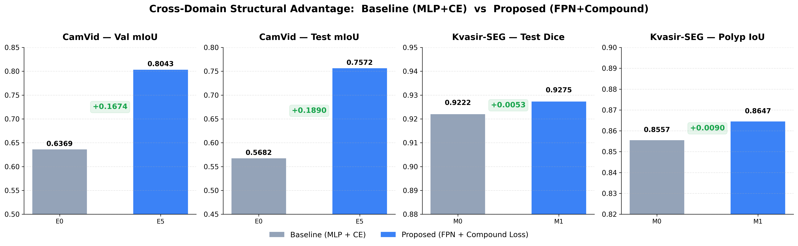
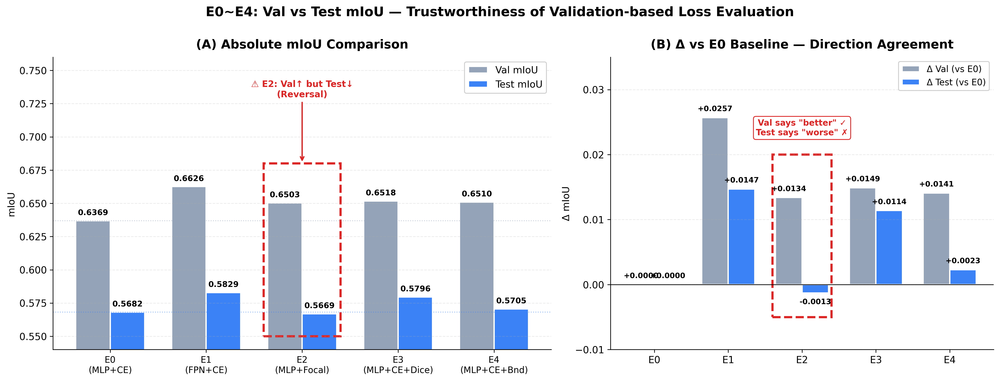
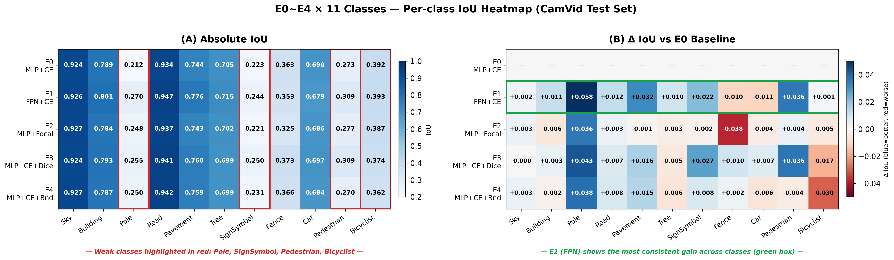
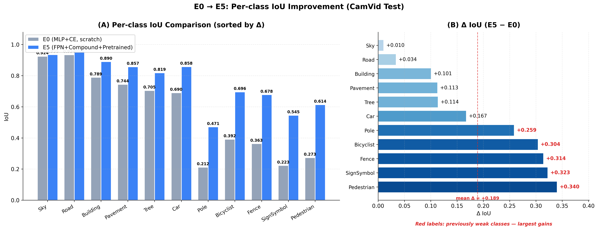
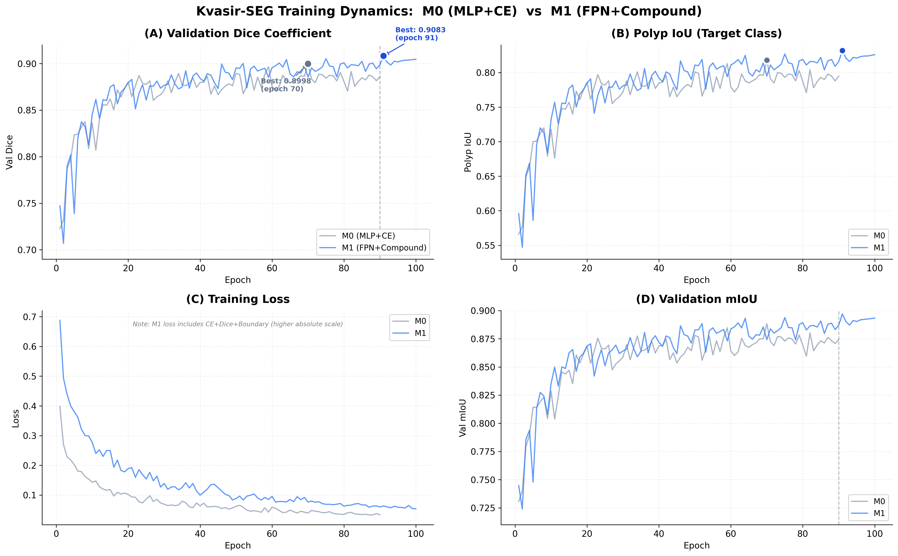

# SegFormer-B0 Semantic Segmentation Experiments

경량 SegFormer-B0 기반 semantic segmentation 구조 개선 및 일반화 성능 분석 프로젝트.

---

## 1. Research Motivation

### SegFormer-B0의 구조적 한계

기존 SegFormer, 특히 경량 모델인 **SegFormer-B0**는 다음과 같은 구조적 한계를 가진다.

- **인코더 용량에 따른 성능 편차**
  - 동일한 디코더 구조를 사용하더라도 B0~B5 사이에서 mIoU 차이가 크게 발생
  - 경량 encoder(B0)일수록 decoder 표현력 부족 문제가 두드러질 가능성이 존재

- **기존 MLP Decoder의 단순 Fusion 구조**
  - 단순 concatenation 기반 fusion 사용
  - multi-scale feature interaction 부족

- **세부 표현력 부족**
  - boundary
  - small object
  - thin structure

  등에 대한 정밀 segmentation 성능 저하 가능성이 존재

이러한 한계는 특히 CamVid와 같은 도시 도로 데이터셋에서
Pole, Pedestrian, SignSymbol과 같은 소형 객체 인식 성능 저하로 이어질 수 있다.

---

### 연구 목표

본 프로젝트는 다음을 검증하는 것을 목표로 한다.

1. Decoder 구조 변경(FPN)이 경량 encoder의 한계를 완화할 수 있는가?
2. Loss 함수 조합이 segmentation 성능에 어떤 영향을 미치는가?
3. 우리가 도입한 파이프라인이 의료 segmentation domain(Kvasir-SEG)에도 적용 가능한가?

---

## 2. Experimental Design

### Core Principles

- **Encoder 고정**
  - MiT-B0 구조 유지
  - Encoder 자체 구조 수정 금지
  - General-purpose segmentation pipeline 검증을 위해 encoder는 고정
  - 단, 실험 및 재사용성을 위해 encoder 구조를 모듈화 형태로만 재구성
  - 기능적 변경이나 추가 연산은 적용하지 않음

- **Single-variable Principle**
  - E0\~E4는 Decoder 또는 Loss 중 하나만 변경
  - 동일 학습 조건 유지

- **공정 비교 원칙**
  - 동일 데이터셋
  - 동일 학습 epoch
  - 동일 augmentation 조건

- **E5**
  - E0\~E4 결과 기반 복합 확장 실험
  - FPN + CE+Dice+Boundary + pretrained + diff-LR + aug 적용

---

## 3. Experiment Overview

| Experiment | Domain | Decoder | Loss | Main Change | Test mIoU / Dice |
|------------|--------|---------|------|-------------|-----------------|
| E0 | CamVid | MLP | CE | Baseline | 0.5682 |
| E1 | CamVid | FPN | CE | Decoder | 0.5829 |
| E2 | CamVid | MLP | Focal | Loss | 0.5669 |
| E3 | CamVid | MLP | CE+Dice | Loss | 0.5796 |
| E4 | CamVid | MLP | CE+Boundary | Loss | 0.5705 |
| E5 | CamVid | FPN | CE+Dice+Boundary | Composite | 0.7572 |
| M0 | Kvasir-SEG | MLP | CE | Medical Baseline | 0.9222 (Dice) |
| M1 | Kvasir-SEG | FPN | CE+Dice+Boundary | Medical Composite | 0.9275 (Dice) |

---

## 4. CamVid Results

### Test mIoU

| Experiment | Test mIoU | Δ from E0 |
|------------|-----------|------------|
| E0 | 0.5682 | — |
| E1 | 0.5829 | +0.0147 |
| E2 | 0.5669 | −0.0013 |
| E3 | 0.5796 | +0.0114 |
| E4 | 0.5705 | +0.0023 |
| **E5** | **0.7572** | **+0.1890** |

---

### Cross-Domain Structural Comparison



- 모든 도메인에서 FPN + Compound 구조가 baseline을 상회
- CamVid와 의료 segmentation 모두에서 일관된 성능 향상 확인

---

### Val vs Test Generalization Analysis



- E2(Focal)는 validation에서는 개선처럼 보이지만
  test에서는 성능 역전 발생
- CE+Dice(E3)는 가장 안정적인 일반화 성능을 보임

---

### Per-class IoU Analysis



- FPN(E1)은 대부분 클래스에서 일관된 향상
- 특히:
  - Pole
  - Pedestrian
  - SignSymbol

  등 소형 객체에서 개선 확인

---

### E0 → E5 Improvement



소형 객체 클래스에서 가장 큰 향상 발생:

- Pedestrian: +0.340
- SignSymbol: +0.323
- Fence: +0.314
- Bicyclist: +0.304
- Pole: +0.259

---

## 5. Kvasir-SEG Results

### Test Metrics

| Experiment | Test Dice | Test mIoU |
|------------|-----------|-----------|
| M0 | 0.9222 | 0.9147 |
| **M1** | **0.9275** | **0.9201** |

---

### Training Dynamics



- M1은 더 안정적인 수렴 패턴을 보임
- 후반 epoch에서도 지속적으로 best metric 갱신
- 의료 segmentation domain에서도 구조적 일반화 가능성 확인

---

## 6. Key Findings

1. **FPN Decoder는 MLP 대비 더 안정적이고 일관된 성능 향상**을 제공한다.
2. **CE+Dice 조합이 가장 안정적인 loss 구성**으로 확인되었다.
3. **Focal Loss는 validation 대비 test 일반화 성능이 불안정**했다.
4. **E5 성능 향상의 핵심 요인은 pretrained encoder와 구조적 개선의 결합**으로 해석된다.
5. 동일 파이프라인이 의료 segmentation domain에도 효과적으로 적용되었다.

---

## 7. Repository Structure

```text
experiments/E{N}_{name}/README.md
analysis/final_report.md
figure/
```

---

## 8. Notes

- Encoder는 SegFormer-B0 구조를 유지한다.
- E0\~E4는 single-variable principle을 엄격히 따른다.
- MMSegmentation 없이 pure PyTorch 기반으로 구현하였다.
